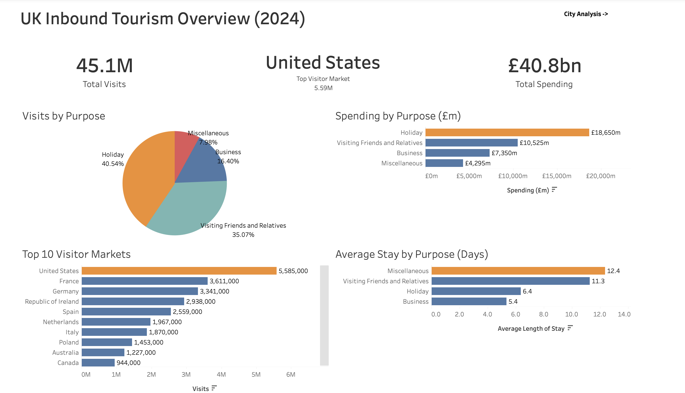
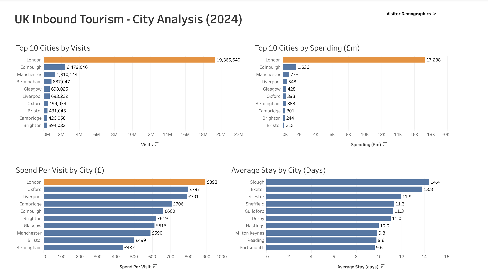
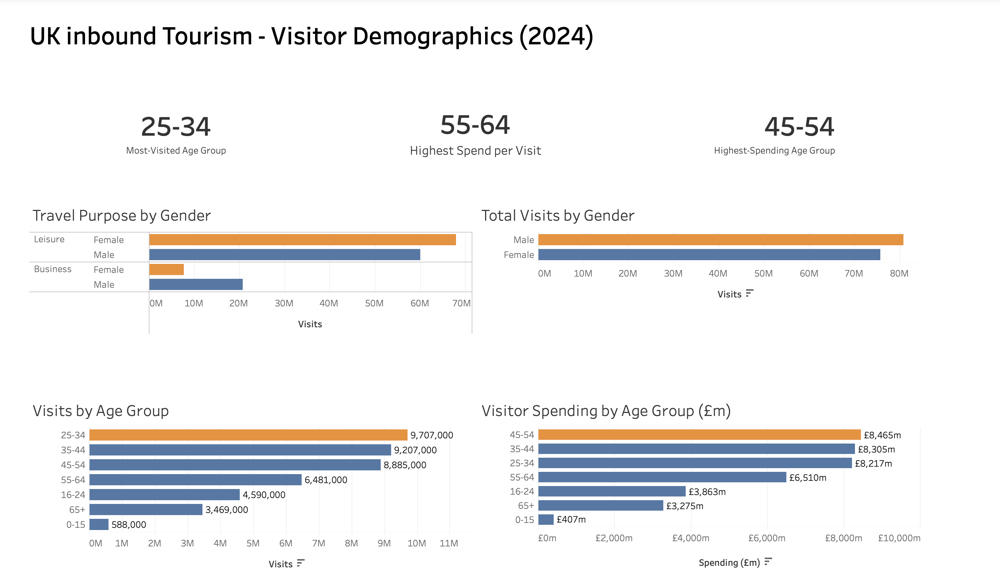

# UK Inbound Tourism Analysis

## Project Overview

This project analyses UK inbound tourism data to explore visitor behaviour, spending patterns, popular destinations and demographic trends.

I used SQL Server to clean, transform and analyse the data, before building interactive dashboards in Tableau to present the key findings.

## Tools Used

- SQL
- Tableau
- GitHub

## Analysis

The analysis focused on:

- Overall visitor volumes and spending
- Main reasons for visiting the UK
- Top international visitor markets
- Visitor spending and average length of stay
- Most visited UK cities
- Spend per visit by city
- Visitor behaviour across age groups and gender

## Key Findings

- The UK received approximately 45.1 million inbound visits, generating around £40.8 billion in visitor spending.
- The United States was the largest visitor market, contributing approximately 5.59 million visits.
- Holiday travel accounted for the largest share of visits and visitor spending.
- London overwhelmingly dominated UK cities for both visitor numbers and total spending.
- Despite London's dominance, Oxford and Liverpool recorded relatively high spend per visit, showing that the most visited destinations are not necessarily the highest-value destinations per trip.
- Miscellaneous travel had the longest average stay at 12.4 days despite representing only 7.98% of visits.
- The 25–34 age group recorded the highest number of visits, while the 45–54 age group generated the highest overall spending.
- Interestingly, the 55–64 age group recorded the highest spend per visit, suggesting that the highest-value visitors were not the most frequent visitors.

## Tableau Dashboards

### UK Inbound Tourism Overview

### City Analysis

### Visitor Demographics

## SQL Workflow

The SQL portion of the project is organised into three stages:

**1. Data Preparation**  
Cleaning and preparing the tourism datasets for analysis.

**2. Exploratory Analysis**  
Querying the cleaned data to identify patterns across visitor numbers, spending, destinations and demographics.

**3. Tableau Output**  
Producing the final datasets and metrics used to build the Tableau dashboards.

## Repository Files

- `01_data_preparation.sql` – data preparation and cleaning
- `02_exploratory_analysis.sql` – exploratory SQL analysis
- `03_tableau_output.sql` – queries used to prepare Tableau outputs

## Skills Demonstrated

SQL data cleaning • Data transformation • Aggregation • Exploratory data analysis • KPI development • Data visualisation • Dashboard design • Communicating analytical insights
